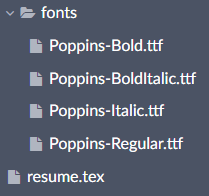

**Helpful for getting afm fonts:** https://www.luft.co.jp/cgi/en/pfb-afm.php


## If Integrating Into Latex Or Overleaf:

```latex
% Poppins font - Requires XeLatex Compiler
\usepackage{fontspec}
\setmainfont{Poppins}[
    Path=fonts/,
    UprightFont=*-Regular,
    BoldFont=*-Bold,
    ItalicFont=*-Italic,
    BoldItalicFont=*-BoldItalic,
    SmallCapsFont=*-Bold
]
```

